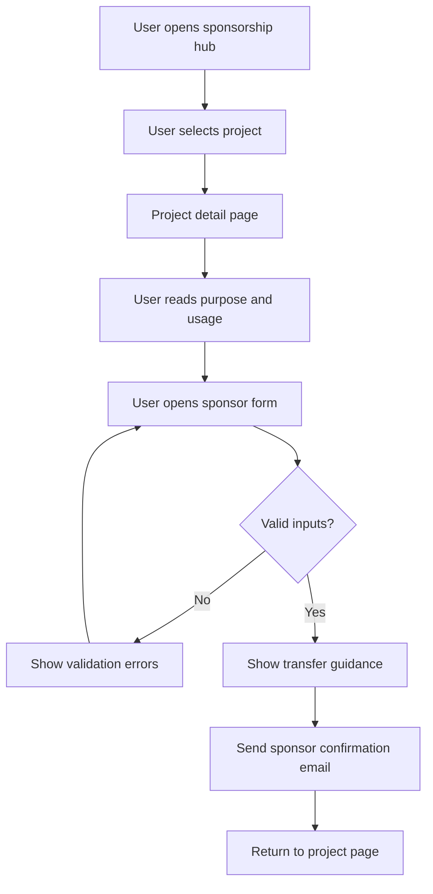
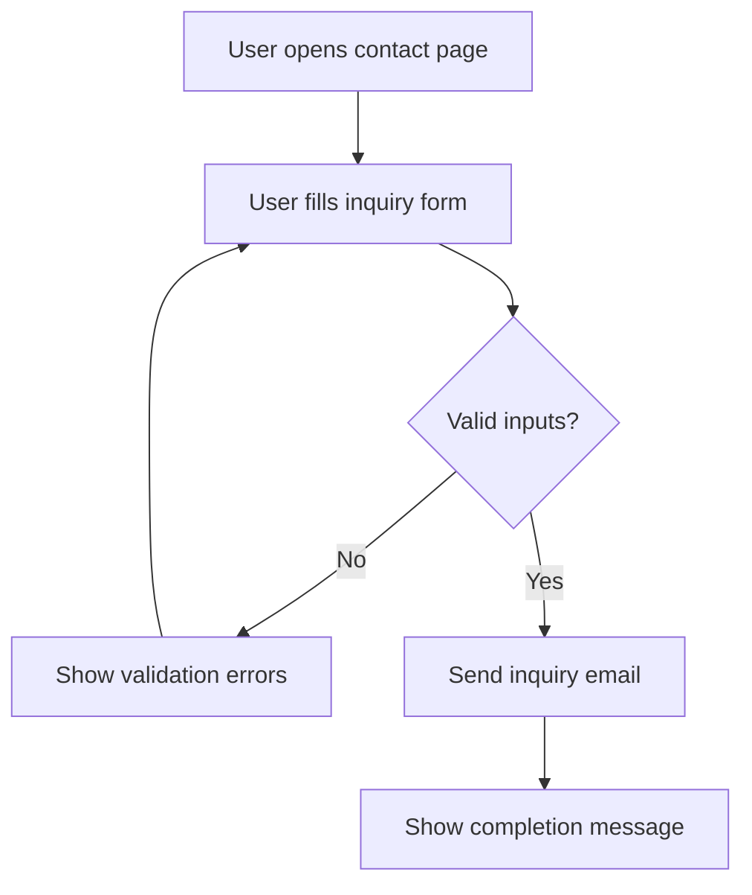

# User Flow - KBFA Homepage

> Date: 2026-04-03
> Status: Draft

## Sponsorship Project Flow

```mermaid
flowchart TD
    A[User opens sponsorship hub] --> B[User selects project]
    B --> C[Project detail page]
    C --> D[User reads purpose and usage]
    D --> E[User opens sponsor form]
    E --> F{Valid inputs?}
    F -->|No| G[Show validation errors]
    G --> E
    F -->|Yes| H[Show transfer guidance]
    H --> I[Send sponsor confirmation email]
    I --> J[Return to project page]
```

## Inquiry Flow

```mermaid
flowchart TD
    A[User opens contact page] --> B[User fills inquiry form]
    B --> C{Valid inputs?}
    C -->|No| D[Show validation errors]
    D --> B
    C -->|Yes| E[Send inquiry email]
    E --> F[Show completion message]
```
